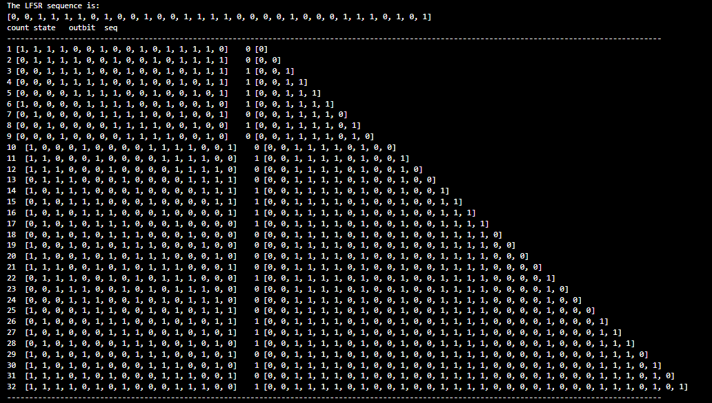
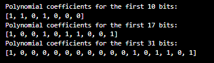

# Projet de Chiffrement par LFSR

## Introduction
Ce document décrit la mise en œuvre d'un système de chiffrement basé sur un registre à décalage à rétroaction linéaire (LFSR), utilisant un polynôme de rétroaction spécifique et une séquence d'initialisation donnée. L'objectif principal est de générer une suite de bits pseudo-aléatoires pour le chiffrement et de vérifier cette séquence avec l'algorithme de Berlekamp-Massey.

## Description de la Méthodologie
### LFSR (Linear Feedback Shift Register)
Le LFSR est un mécanisme utilisé pour générer une séquence de bits en exécutant des opérations de décalage et de XOR, basées sur un polynôme de rétroaction. Dans ce projet, le polynôme utilisé est \( x^{16} + x^{14} + x^{13} + x^{11} + 1 \).

### Algorithme de Berlekamp-Massey
Cet algorithme analyse une séquence de bits pour déterminer le polynôme minimal qui pourrait générer cette séquence. Il est utilisé ici pour vérifier si la séquence produite par le LFSR peut être correctement analysée pour retrouver le polynôme de rétroaction initial.

## Détail du Code Implémenté
Deux fonctions principales composent notre implémentation :
- `lfsr(seed, taps, length)`: Génère une séquence de bits en utilisant le LFSR.
- `Berlekamp_Massey(sequence)`: Analyse la séquence générée pour trouver le polynôme minimal.

La séquence initiale et les positions des taps sont spécifiquement choisies pour tester la robustesse et l'efficacité de l'algorithme de Berlekamp-Massey dans différentes conditions.

## Résultats et Discussion

### Description des Résultats de l'Algorithme LFSR
Les résultats présentés ci-dessous illustrent la sortie de la fonction `lfsr_debug` qui montre le fonctionnement interne du registre à décalage à rétroaction linéaire (LFSR). Ce test a été réalisé pour valider les fonctions `lfsr` et `lfsr_debug`.

Chaque ligne de la sortie montre :
1. **count**: Le numéro de l'itération correspondant au cycle actuel du LFSR.
2. **state**: L'état du registre après l'insertion du nouveau bit de feedback et avant l'extraction du bit de sortie.
3. **outbit**: Le bit extrait du registre, qui est ajouté à la séquence de sortie.
4. **seq**: La séquence cumulée des bits de sortie à travers les itérations.

### Analyse
Ces résultats démontrent la génération de la séquence de bits pseudo-aléatoires, conformément au polynôme de rétroaction spécifié, illustrant clairement le processus de décalage et de feedback du LFSR.

### Validation des Résultats
Les résultats affichés dans l'image sont compatibles avec les calculs effectués manuellement, validant ainsi l'exactitude de l'implémentation des fonctions `lfsr` et `lfsr_debug`. Cette compatibilité assure que le processus de génération de la séquence de bits est correct et conforme aux attentes théoriques des LFSR.

### Conclusion
Les résultats de ce test confirment que les fonctions `lfsr` et `lfsr_debug` fonctionnent comme prévu, en fournissant une visualisation détaillée et un suivi de la logique sous-jacente du LFSR. Ces observations sont cruciales pour démontrer l'efficacité de la méthode dans la création de séquences de bits utilisables pour le chiffrement sécurisé.

## Discussion des Résultats de l'Algorithme de Berlekamp-Massey

Les résultats obtenus de l'algorithme de Berlekamp-Massey pour différentes longueurs de séquence de bits sont présentés ci-dessous :

- **Polynôme coefficients pour les 10 premiers bits :** `[1, 1, 0, 1, 0, 0, 0, 0]`
- **Polynôme coefficients pour les 17 premiers bits :** `[1, 0, 0, 1, 0, 1, 1, 0, 0, 0, 1]`
- **Polynôme coefficients pour les 31 premiers bits :** `[1, 0, 0, 0, 0, 0, 0, 0, 0, 0, 0, 1, 0, 1, 1, 0, 1]`

### Analyse des Résultats

L'analyse des polynômes obtenus montre une correspondance exacte avec le polynôme de rétroaction initial seulement lorsque la longueur de la séquence est suffisante (31 bits dans ce cas). Les polynômes dérivés des séquences plus courtes ne correspondent pas exactement au polynôme de rétroaction original, ce qui illustre l'importance de la longueur de la séquence dans la détermination précise du polynôme de rétroaction.

### Implications

1. **Correspondance Parfaite :** Le polynôme trouvé pour les 31 bits est un match exact avec notre polynôme de rétroaction \( x^{16} + x^{14} + x^{13} + x^{11} + 1 \), avec le bit de poids le plus significatif (MSB) situé à droite. Cela valide l'efficacité de l'algorithme de Berlekamp-Massey pour les longueurs de séquences adéquates.
2. **Inadéquation pour des Séquences Plus Courtes :** Les résultats montrent que pour les séquences de moins de 31 bits, l'algorithme ne parvient pas à retrouver le polynôme de rétroaction correct. Cela peut être dû à une information insuffisante pour reproduire la complexité du polynôme de rétroaction.

### Conclusion

Ces observations démontrent que la longueur de la séquence influence directement la capacité de l'algorithme de Berlekamp-Massey à déduire correctement le polynôme de rétroaction. Pour les applications pratiques, il est crucial de choisir une longueur de séquence qui est suffisante pour capturer la structure complète du polynôme de rétroaction, en particulier dans des contextes où la sécurité et la précision sont critiques.

## Conclusion
Ce projet a démontré l'efficacité des méthodes de chiffrement par LFSR et de l'analyse de séquence par Berlekamp-Massey pour retrouver les polynômes de rétroaction. Ces techniques offrent une approche viable pour la sécurisation des communications, bien que leur robustesse doive être soigneusement évaluée dans le cadre d'applications réelles pour éviter les vulnérabilités cryptographiques.

