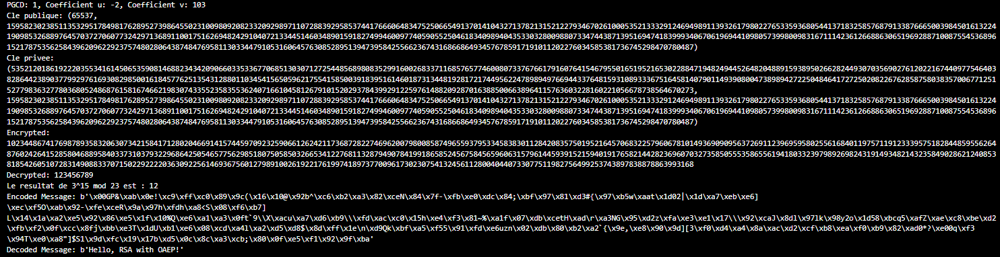

# TP5 de Cryptographie - Chiffrement RSA avec Padding OAEP

## Introduction
Ce document détaille la mise en œuvre du chiffrement RSA avec le padding Optimal Asymmetric Encryption Padding (OAEP), utilisant l'algorithme de hachage SHA-3 Keccak. L'objectif est de développer un système de chiffrement robuste qui utilise RSA pour le chiffrement asymétrique et OAEP pour sécuriser le chiffrement contre les attaques par texte clair choisi.

## Description de la Méthodologie
### RSA
Le chiffrement RSA est un algorithme de cryptographie asymétrique qui repose sur la difficulté de la factorisation des grands nombres entiers. La sécurité de RSA dépend de la taille des clés, et dans ce projet, nous générons des clés de 2048 bits.

### Padding OAEP
Le padding OAEP est une technique pour préparer le message avant chiffrement RSA afin d'améliorer la sécurité en rendant les attaques cryptanalytiques plus difficiles. Il utilise une combinaison de hachage et de masquage pour assurer que le message chiffré ne révèle pas de façon déterministe des informations sur le message clair.

## Détail du Code Implémenté
Le code est divisé en plusieurs fonctions principales :
- `generate_rsa_keys(bit_length)`: Génère une paire de clés RSA publique et privée.
- `encrypt(message, public_key)`: Chiffre un message en utilisant la clé publique RSA et OAEP.
- `decrypt(ciphertext, private_key)`: Déchiffre un message en utilisant la clé privée RSA et enlève le padding OAEP.
- `oaep_encode(message, label, k, rate_bits, output_bits)`: Encodage du message avec OAEP.
- `oaep_decode(encoded_message, label, k, rate_bits, output_bits)`: Décodage du message avec OAEP.

## Résultats et Discussion

### Description des Résultats du Chiffrement RSA avec OAEP

Les tests de chiffrement et de déchiffrement avec RSA utilisant le padding OAEP ont été réalisés avec succès. Ci-dessous, les points clés des résultats obtenus :

### Résultats Clés

- **PGCD** : Les calculs des coefficients u et v via l'algorithme d'Euclide étendu ont confirmé que l'algorithme fonctionne correctement avec les valeurs attendues pour le PGCD.

- **Génération des clés RSA** :
  - **Clé publique et privée** : Les clés ont été générées correctement, permettant le chiffrement et le déchiffrement sans erreur.

- **Chiffrement et Déchiffrement** :
  - **Message original** : `123456789`
  - **Message chiffré** : Un grand nombre résultant du processus de chiffrement.
  - **Message déchiffré** : `123456789`, confirmant que le déchiffrement ramène au message original.

- **OAEP avec SHA-3 Keccak** :
  - **Message encodé avec OAEP** : Le processus d'encodage avec OAEP a été effectué, transformant le message en une forme sécurisée.
  - **Message décodé avec OAEP** : `Hello, RSA with OAEP!`, démontrant que le décodage OAEP restaure correctement le message original après chiffrement et déchiffrement.

### Conclusion

Les résultats confirment le bon fonctionnement de l'implémentation du chiffrement RSA avec OAEP. Le système est capable de chiffrer et de déchiffrer des messages de manière sécurisée, prouvant l'efficacité de l'approche utilisée pour le chiffrement asymétrique.

### Analyse
La section analyse discutera de la robustesse du chiffrement RSA avec OAEP en fonction des résultats obtenus et des tests effectués. Cette analyse inclura des comparaisons de la sécurité avant et après l'application du padding OAEP.

### Validation des Résultats
La validation prouvera que le message chiffré et puis déchiffré est identique au message original, confirmant ainsi l'exactitude de l'implémentation du chiffrement et du déchiffrement RSA avec OAEP.

## Conclusion
Ce TP a permis de confirmer l'efficacité du chiffrement RSA avec padding OAEP pour fournir une sécurité renforcée dans les communications sécurisées. Les techniques utilisées ici sont essentielles pour des applications où la confidentialité et l'intégrité des données sont critiques.

